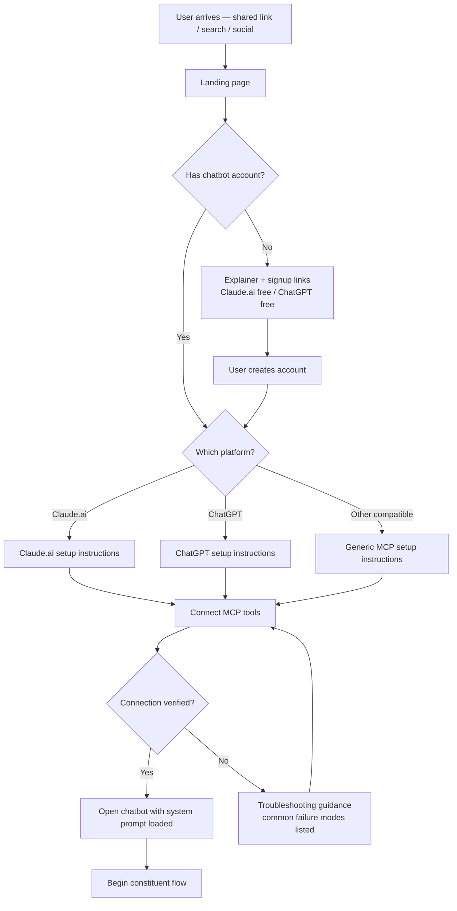
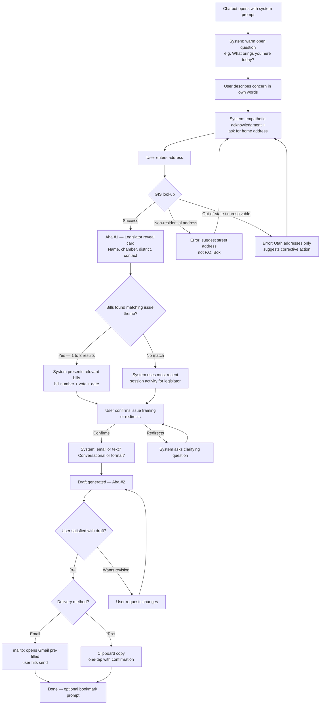
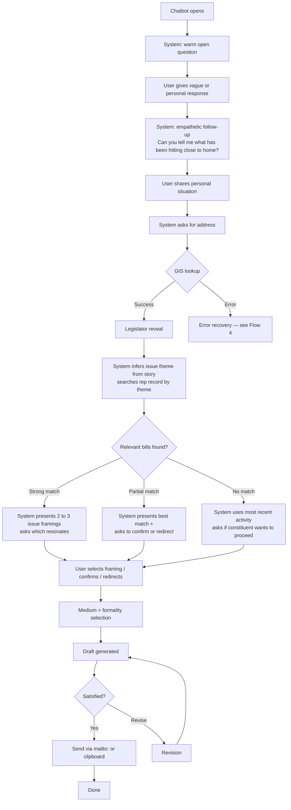
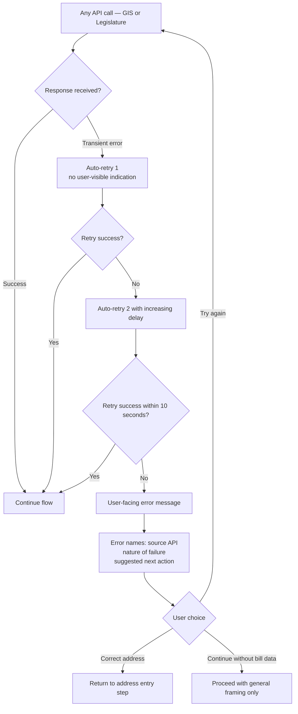

# UX Design Specification write-your-legislator

**Author:** Corey
**Date:** 2026-02-21

---

<!-- UX design content will be appended sequentially through collaborative workflow steps -->

## Executive Summary

### Project Vision

Write Your Legislator is a civic engagement web application that helps progressive Utahns send credible, specific, personal messages to their state legislators — grounded in that legislator's actual bill and vote record. The core insight: a single specific message from a constituent who clearly knows what their rep voted on is more impactful than hundreds of form letters. The UX must deliver that specificity without requiring the user to research anything themselves.

The BYOLLM (Bring-Your-Own-LLM) architecture means users plug the MCP tools into their own Claude.ai or ChatGPT account. The app provides the intelligence layer (legislator lookup, bill search, voice-calibrated drafting) while the user's existing subscription handles LLM inference. This creates zero marginal cost for the operator and scales output quality with the user's model tier — but introduces a non-trivial onboarding challenge for non-technical users.

### Target Users

| Persona | Profile | Entry Point | Key Anxiety |
|---|---|---|---|
| Deb | 54, art teacher, PAC attendee, non-technical | Signal group link, iPhone | "I don't know enough. I'll sound like an idiot." |
| Marcus | 31, developer, not politically organized | Bluesky post | "I don't even know where to start." |
| Corey (operator) | Solo developer | Terminal / log stream | Observability without a custom UI |
| Civic tech dev | Developer building for another state | GitHub / Mastodon | MCP tool extensibility |

Primary focus is Deb and Marcus — motivated constituents who want to make contact but lack the confidence or knowledge to do it without help. Both are likely on mobile at the moment they encounter the tool for the first time.

### Key Design Challenges

1. **BYOLLM onboarding** (highest-priority risk): Non-technical PAC attendees must successfully connect MCP tools to their chatbot platform. The landing page and setup flow must work for someone who has never heard of MCP.
2. **Voice authenticity** (primary failure mode): If the output reads as AI-generated, the tool fails at its core purpose. The conversational input capture must feel personal enough that the LLM reflects the user's own voice — not a template — back to them.
3. **Mobile-first, post-meeting context**: First users will be on phones directly after an Elevate Utah meeting. The primary flow must be frictionless at 375px with no hover-dependent interactions.
4. **Guided vs. open-ended entry**: Deb knows she's upset about Prop 4. Marcus just knows things are wrong. The flow must handle both starting points gracefully without feeling like a form.
5. **Trust with political data**: Users are referencing a legislator's actual record. Source citations must be visible and credible without cluttering the draft output.

### Design Opportunities

1. **The "aha" moment**: When a user sees their legislator's actual vote referenced by bill number in their own words, that is the emotional peak of the product. The UX should be structured to deliver and amplify this moment.
2. **One-click delivery as satisfaction**: The mailto: link opening Gmail with a pre-filled, ready-to-send message is the product's payoff. Removing every friction point here is high-leverage.
3. **Landing page as trust-builder**: The landing page must explain the tool in plain language, build credibility with a skeptical first-time visitor, and walk a non-technical user through BYOLLM setup — all in one surface. Clear, human, non-partisan copy is a UX differentiator.
4. **Transparent sourcing as feature**: Surfacing citations (bill number, session, vote date) is not just a compliance requirement — it is what makes the user trust the output and sends a message a legislator's office cannot dismiss as a form letter.

## Core User Experience

### Defining Experience

The one thing users do is: describe who they are and what they care about, then send a message their legislator cannot dismiss as a form letter.

The core loop is linear with two distinct designed payoff moments:

1. Enter home address → system identifies their legislators
2. Describe concern in own words (open text, no form fields)
3. Review and confirm the legislator context and bill reference surfaced
4. **Aha #1 — The Reveal:** Address resolves and the user sees their actual legislator named — the moment the tool stops feeling generic and becomes real and personal. This beat is designed deliberately, not incidental.
5. Receive a draft in their voice, grounded in real legislative record
6. **Aha #2 — The Draft:** Reading the output and seeing a real bill number alongside their own words — the moment the product's core value becomes tangible. Primary failure mode is the inverse: reading it and thinking "this sounds like AI."
7. Send in one action (mailto: or clipboard)

### Platform Strategy

- Web app, no native app at MVP — all platforms via browser
- Mobile-first, touch-primary: 375px is the design-first viewport; 320px minimum
- No hover-dependent interactions anywhere in the primary flow
- Browser targets: iOS Safari and Android Chrome are equal-priority to desktop (Chrome, Firefox, Safari, Edge)
- Clipboard API for text copy; mailto: URI for email — no server-side delivery
- No offline: all flows require live MCP tool connectivity
- No device capabilities beyond clipboard needed at MVP

### Effortless Interactions

| Interaction | Why it must be effortless |
|---|---|
| Address entry | Any friction here abandons the whole flow |
| Free-text concern description | Must feel like talking, not filling out a form |
| Mailto: open in email client | The payoff — one tap, Gmail opens, it's done |
| Clipboard copy | Same for text — one tap, paste and send |
| BYOLLM MCP setup | Highest-risk onboarding; must not require technical vocabulary |
| "Bookmark for next session" | Low-cost exit moment that seeds return usage |

### Critical Success Moments

1. **"That's my rep"** — address resolves and the user sees their actual senator or representative named; designed as a deliberate reveal, not a text field result
2. **"That's actually what they voted"** — a specific bill number and vote appears; the moment the product's value becomes tangible
3. **"This sounds like me"** — reading the draft and recognizing their own voice and concern reflected back
4. **"I actually sent it"** — clicking mailto: and seeing Gmail open pre-filled; the emotional resolution of a task users have abandoned many times before

**Failure modes to design against:**
- BYOLLM setup confusion → user gives up before the actual flow
- Address fails silently or with an unhelpful message
- Draft is generic, formal, or reads as AI output
- Mailto: link broken or not opening on mobile iOS
- Error states that feel like dead ends rather than redirections

### Experience Principles

1. **The constituent is the protagonist** — every screen, message, and error state should center the constituent's power and purpose, not the tool's capabilities. "You already are something powerful."

2. **Conversation, not form** — input capture feels like talking to a knowledgeable friend. *Applies to: system prompt design and landing page copy. Note: the chatbot conversation UI itself is owned by the user's platform (Claude.ai, ChatGPT) and shaped primarily through system prompt quality.*

3. **Design the data, design the output** — MCP tool response schema is a UX decision. The structure and richness of what tools return directly determines how specific and credible the generated draft is.

4. **Effortless delivery** — from draft to sent is one action; any additional step is a drop-off risk

5. **Trust through transparency** — bill numbers, vote dates, and source citations are features, not footnotes; extends to failure states, which must identify what went wrong and offer a clear path forward

6. **Honest about AI, unapologetic about why** — the tool does not hide its AI involvement; it frames AI as the means, not the point. The constituent's knowledge, anger, and voice are the point. BYOLLM model is a genuine asset with this audience: no new AI demand created, uses existing subscription.

7. **Mobile-first, always** — design proven at 375px before desktop; no hover-dependent interactions in any primary flow

## Desired Emotional Response

### Primary Emotional Goals

**Primary: Agency** — the feeling of having done something real and specific that couldn't be dismissed. Not "I used AI." Not "that was easy." The sense that their voice reached a place it hadn't reached before, with specificity that matters.

**Supporting:** Trust, Validation, Pride, Accomplishment

**To actively avoid:** Shame (at using AI), Hollowness (generic draft), Confusion (during setup or errors), Passivity (AI did it, not them)

### Emotional Journey Mapping

| Stage | Starting emotion | Target emotion | Design lever |
|---|---|---|---|
| Landing page | Skepticism, AI wariness | Curious, cautiously trusting | Copy leads with constituent power, acknowledges ambivalence |
| BYOLLM setup | Anxiety ("not technical enough") | Capable, in control | Frame setup as gaining a skill; step-by-step clarity |
| Address entry | Neutral | Anticipation | Minimal friction; fast resolve |
| Aha #1 — Legislator named | Neutral | Recognition — "this is real" | Deliberate reveal; not just a text result |
| Issue description | Hesitant ("I don't know enough") | Validated — "yes, that matters" | Open, conversational prompt; empathetic framing |
| Aha #2 — Draft with bill number | Cautious | Recognition + relief + pride | Draft quality is the emotional centerpiece |
| Send moment | Draft in hand | Accomplishment + agency — "I did it" | One action; Gmail opens; task complete |
| Error states | Frustration | Redirected, still capable | Errors name problem and offer next step; no dead ends |
| Return visit | Mild inertia | Habit-forming comfort | Familiar flow; "bookmark this" |

### Micro-Emotions

| Pair | Target state | Moment |
|---|---|---|
| Confidence vs. confusion | Confidence | Setup and address entry |
| Trust vs. skepticism | Trust | Citation visibility, AI disclosure |
| Validation vs. dismissal | Validation | Issue description conversation |
| Recognition vs. alienation | Recognition | Draft voice and specificity |
| Accomplishment vs. futility | Accomplishment | Send moment |
| Agency vs. passivity | Agency | Overall arc — constituent is protagonist |
| Capable vs. ashamed | Capable | AI framing: tool, not identity |

### Design Implications

| Desired emotion | UX approach |
|---|---|
| Agency | Every step gives a meaningful choice; draft is theirs to edit |
| Trust | Citations are visible features; AI disclosure is upfront; errors name their source |
| Validation | Bot responds to the emotion before moving to facts |
| Pride | Voice calibration is a design constraint, not a nice-to-have |
| Capable (not ashamed) | "You already are something powerful" throughout |
| Accomplishment | Send moment is the emotional peak; mailto: works on iOS; one tap |
| Redirected on failure | Every error: what went wrong, why, what to try next |

### Emotional Design Principles

1. **Convert stuckness into agency** — users arrive frustrated and qualified but feeling unqualified; the design job is not to create delight from neutral but to move them from stuck to done
2. **The constituent did this, not the AI** — every touchpoint reinforces that the user's knowledge, concern, and voice are the active ingredients; the tool is the instrument
3. **Validate before informing** — the conversation should acknowledge the personal story and emotion before pivoting to legislative data
4. **The send moment is sacred** — no friction between draft-in-hand and sent; this is the emotional resolution of everything that came before
5. **Errors redirect, never dead-end** — frustration is recoverable; confusion without a next step is not

## UX Pattern Analysis & Inspiration

### Inspiring Products Analysis

**myLegislature (utah.gov) — Primary Anti-Pattern Reference**

Users who know this tool have already tried to engage with the legislature and found the experience frustrating — they're motivated enough to have gone looking and hit a wall. Write Your Legislator is partly a redemption arc for this experience.

Useful patterns to understand: bill tracking with email notifications gives users a familiar "watch a bill" mental model useful for return usage framing. Address/district lookup exists — the bar to clear is known.

What it does poorly: dense information display not optimized for mobile; map/district lookup is multi-step and GIS-native; government-form aesthetic signals bureaucratic process; assumes you know what you're looking for. Key lesson: the contrast should be felt immediately — where myLegislature is dense and navigational, Write Your Legislator is linear and conversational.

**Threads / Bluesky — Composition & Mobile-First Reference**

Both primary personas likely use at least one. Both are text-first, mobile-native, minimal-overhead composition experiences.

What transfers: compose-first model (single focused text area, no form chrome, start typing immediately); one-tap clipboard copy with immediate confirmation; low cognitive load (one primary action per screen); minimal chrome around the primary action.

**Signal — Trust & Clipboard Reference**

Deb uses Signal as her organizing tool — she associates it with people she trusts and information she acts on. The act of copying text from Signal to send elsewhere is the exact mental model for the clipboard delivery path.

What transfers: trust through restraint (minimal UI signals "not selling you anything"); clipboard copy as familiar action pattern; mobile-first as default.

### Transferable UX Patterns

| Pattern | Source | Apply to |
|---|---|---|
| Compose-first (open text, no required fields) | Threads / Bluesky | Issue description step |
| One-tap clipboard copy with confirmation | Threads / Bluesky / Signal | Text/SMS delivery |
| Immediate, visual address resolution | Maps mental model | Aha #1 — legislator reveal |
| Trust through restraint (minimal UI) | Signal | Overall visual language |
| "Watch something, get notified" | myLegislature | Return usage / bookmark prompt |
| Single primary action per screen | Bluesky mobile | Full flow — one thing at a time |

### Anti-Patterns to Avoid

| Anti-pattern | Why | Applies to |
|---|---|---|
| Multi-step map interface for district lookup | Users have already bounced on this | Address entry + resolution |
| Dense information hierarchy | Signals bureaucracy, not capability | All screens |
| Form-first entry (required fields before starting) | Breaks conversation principle | Issue description |
| Government aesthetic (blue/grey/table-heavy) | Activates "this will be painful" | Visual design |
| Account required before any value | Kills early funnel; BYOLLM already asks a lot | Onboarding |
| Passive engagement only (watch, don't act) | Users need agency, not observation | All delivery steps |

### Design Inspiration Strategy

**Adopt:**
- Compose-first interaction model for issue description — open text area, no required fields, conversational prompt
- One-tap clipboard copy with immediate feedback for text/SMS delivery
- Single-action-per-screen structure throughout the primary flow

**Adapt:**
- myLegislature's bill notification concept → reframe as proactive return prompt ("bookmark this for next session") rather than passive watching
- Maps-style address resolution → faster, conversational, no map UI required; result appears as a named card, not a pin

**Reject:**
- Any map or GIS-native UI for district lookup — the resolution must feel instant and textual, not cartographic
- Government visual language entirely — the product should feel like a civic tool built by people, not a government portal
- Form patterns anywhere in the primary flow

## Design Direction Decision

### Design Directions Explored

Six directions were explored: Pure Minimal (D1), Warm Civic (D2), Editorial (D3), App-Forward (D4), High Contrast Accessible (D5), and Letter-Centered (D6). Full interactive mockups at `ux-design-directions.html`.

### Chosen Direction

**D2 + D4 Hybrid: Warm Civic with Guided Progress Structure**

- **Visual aesthetic**: D2 (Warm Civic) — cards with soft shadows, amber accent, off-white surface, human and approachable feel, restrained civic palette
- **Navigation structure**: D4 (App-Forward) — progress indicator across the top of the flow showing current step (Address → Rep → Issue → Send), giving first-time users visible orientation without feeling like a form

### Product Name

**On Record**

Domain target: `getonrecord.org`

Works on multiple levels simultaneously:
- The constituent is going on the record as someone paying attention
- The draft is grounded in the legislator's actual voting record
- Carries a faint accountability/journalism edge appropriate to the mission
- Non-partisan, civic, not tool-branded

### Design Rationale

D2 provides the warmth and human feel needed to counteract AI skepticism and the "government portal" associations users bring from myLegislature. D4's progress structure addresses the anxiety of first-time users (Deb) who need visible confirmation they're moving through a defined flow — without the clinical feeling of a form. Together: structured enough to trust, warm enough to feel made by people.

### Implementation Approach

- **Top bar**: primary deep slate (#1e3a4f) with "On Record" wordmark; amber accent on brand name
- **Progress strip**: amber-filled segments below the top bar indicating completed/active/upcoming steps; step labels in small caps
- **Content**: cards on off-white surface (#fafaf8); soft box-shadow; 10px border-radius; amber accent for primary CTAs
- **Legislator reveal card**: amber top border (3px) to signal the Aha #1 moment — visually distinct from standard cards
- **Draft card**: same card treatment; bill citation rendered as a small pill tag below the draft body
- **Send actions**: primary CTA (Open in Gmail) in deep slate; secondary (Copy for text) as bordered ghost button

### Dark Mode

Dark mode is planned as an explicit user preference alongside the dyslexia font toggle. Both live in a "Reading preferences" section in the footer — not buried in settings, framed as intentional inclusive design.

| Role | Light | Dark |
|---|---|---|
| Background | `#fafaf8` | `#0d1b26` |
| Card surface | `#ffffff` | `#162433` |
| Top bar | `#1e3a4f` | `#0a1520` |
| Text | `#1a1a1a` | `#f0ede8` |
| Accent (amber) | `#c47d2e` | `#d4922a` |
| Subtle borders | `#e5e3df` | `#2a3f50` |
| Muted | `#6b7280` | `#94a3b8` |

Dark palette is warm slate, not cold gray — preserves civic/human character of the light design. Amber accent reads more prominently on dark, which benefits CTA legibility. Implementation: Tailwind `dark:` prefix + shadcn/ui CSS variable system; defaults to system preference (`prefers-color-scheme`) with manual override.

## Design System Foundation

### Design System Choice

**Tailwind CSS + shadcn/ui (React)**

Tailwind CSS as the styling foundation; shadcn/ui for accessible, composable UI components. Framework: React (implied by shadcn/ui; aligns with broadest open-source contributor familiarity).

### Rationale for Selection

- **Solo dev speed**: Tailwind's utility-first approach enables rapid iteration without context-switching between stylesheets; shadcn/ui provides production-ready components without aesthetic baggage
- **No visual opinion**: Unlike Bootstrap or Material, Tailwind starts from nothing — the civic-tool-built-by-people aesthetic comes from design decisions, not library defaults
- **Accessibility by default**: shadcn/ui is built on Radix UI primitives; keyboard navigation, ARIA attributes, and screen reader compatibility are built in — WCAG 2.1 AA compliance for core components without extra work
- **You own the components**: shadcn/ui components are copied into the project, not imported as a dependency — no upstream breaking changes; contributors can modify without framework knowledge
- **Open-source contributor fit**: React + Tailwind is the widest-known stack in the contributor pool; lowest barrier to outside contribution
- **Nothing government-looking**: Tailwind produces exactly what you design; no Material blue, no Bootstrap grey — the visual language is entirely yours

### Implementation Approach

- Install Tailwind CSS via PostCSS; configure design tokens (colors, typography, spacing) using Tailwind v4's `@theme` directive in `globals.css` — note: Tailwind v4 uses CSS-first configuration (`@theme` in `globals.css`), not `tailwind.config.js` as in v3. See architecture document for the canonical implementation.
- Add shadcn/ui components on demand via CLI (`npx shadcn@latest add button`); components live in `src/components/ui/` and are fully editable
- Mobile-first by default: Tailwind's responsive prefixes (`sm:`, `md:`, `lg:`) enforce mobile-first discipline at the class level

### Customization Strategy

- Define a small, intentional color palette using Tailwind v4 `@theme` tokens in `globals.css`, reflecting the brand direction (human, civic, not government) — 1 primary, 1 accent, neutral grays, accessible contrast ratios baked in from the start
- Typography: single typeface, strong hierarchy — the copy does the work; the type system stays out of the way
- Override shadcn/ui defaults minimally — the components are starting points, not constraints
- No custom component built until a shadcn/ui primitive is confirmed insufficient — avoid premature abstraction

## Visual Design Foundation

### Color System

**Direction: Restrained Civic** — minimal execution, civic emotional register. Nothing partisan. Warm without startup-y. Credible without government.

| Role | Color | Hex |
|---|---|---|
| Primary | Deep warm slate | `#1e3a4f` |
| Accent | Warm amber | `#c47d2e` |
| Surface | Off-white | `#fafaf8` |
| Text | Near-black | `#1a1a1a` |
| Subtle borders | Warm light gray | `#e5e3df` |
| Error | Muted red | `#b91c1c` |
| Success | Muted green | `#2e7d52` |

All text/background pairings target ≥4.5:1 WCAG AA contrast. Verified before use.

### Typography System

**Primary typeface: Atkinson Hyperlegible**
- Designed by the Braille Institute for maximum legibility; benefits readers with low vision and dyslexia through strong letter differentiation and distinct character shapes — no mirrored letterforms (b/d, p/q)
- Still clean and modern; not visually marked as an "accessibility typeface"
- Makes dyslexia-friendly the default, not the exception — appropriate for a civic tool intended for all constituents
- Free, open-source, available via Google Fonts

**Dyslexia toggle (Phase 1 or 2):**
- Optional toggle in the UI (footer or settings) to switch to OpenDyslexic for users who prefer a more specialized option
- Implementation: CSS class on root element toggled by user preference, persisted in localStorage — equivalent effort to dark mode
- Signals deliberate inclusive design to users who notice it

**Scale (mobile-first):**
- Display: `text-3xl` / 30px bold — landing page headline
- Heading: `text-xl` / 20px semibold — section headers
- Body: `text-base` / 16px regular — never smaller on mobile
- Meta: `text-sm` / 14px — citations, labels, supporting info
- Minimum: `text-sm` — nothing smaller in the primary flow

### Spacing & Layout Foundation

- Base unit: 8px (Tailwind default)
- Max content width: 680px centered — letter-width; suits the medium
- Layout: single-column always; centered on desktop; this is a flow, not a dashboard
- Mobile padding: `px-4` (16px); tablet+: `px-6` (24px)
- Vertical rhythm: generous — sections breathe; white space signals confidence

### Accessibility Considerations

- All color pairs verified ≥4.5:1 before implementation
- Atkinson Hyperlegible as default typeface benefits dyslexic and low-vision readers without visual compromise
- Dyslexia font toggle (OpenDyslexic) as an explicit feature — persisted in localStorage
- 16px body minimum meets readability needs across the age range of target users
- Focus rings on all interactive elements via Tailwind `ring` utilities
- Touch targets: 44×44px minimum enforced at component level (NFR12)
- shadcn/ui Radix primitives provide keyboard nav and ARIA by default (NFR11)

## Core Interaction Design

### Defining Experience

"Tell me what you care about. I'll help you say it in a way your legislator can't ignore."

Core mechanic: **address → legislator → bill → draft → send**
Five steps, one linear flow, zero dead ends.

### User Mental Model

Users arrive with the *writing a letter* mental model: formal, requires expertise they don't have, high chance of sounding generic. That model is why they've stopped before.

The product silently replaces it with *talking to a knowledgeable friend who helps me find my words*. The shift happens through the conversation, not explanation. By the time the draft appears, the user has been talking — not writing — and the draft reflects that.

### Success Criteria

- User reads the draft and recognizes their own voice
- Draft contains at least one specific citation (bill number, vote, date)
- Send requires exactly one deliberate action after draft is ready
- Total time from landing to sent: under 10 minutes for a motivated user
- Primary failure mode never occurs: no user reads output and thinks "AI wrote this"

### Novel UX Patterns

The novel interactions (MCP tool connection, bill/legislator triangulation) happen on the landing page or inside the LLM conversation — not in custom UI. All UI surfaces use established patterns. Less user education required; faster to trust.

| Sub-interaction | Type | Pattern source |
|---|---|---|
| MCP tool connection | Novel — needs education | Landing page copy + system prompt |
| Conversational input | Established | Messaging / chatbot |
| Address entry + resolution | Established | Food delivery, maps |
| Legislator reveal (Aha #1) | Novel framing, established display | Named card reveal |
| Bill/issue triangulation | Novel | LLM-mediated via system prompt |
| Draft review + edit | Established | Email compose / document preview |
| One-click send | Established | mailto: / clipboard share |

### Experience Mechanics

**Initiation:** User arrives from a shared link. One scroll on mobile explains the tool. Single CTA opens their chatbot with tools pre-configured. No account, no decisions, no form before value begins.

**Interaction:**
1. Chatbot opens with a warm open question — not "enter address" but "what brings you here today?"
2. User describes concern in plain language
3. System asks for address; GIS resolution is invisible
4. **Aha #1:** Legislator named — presented as a card with chamber, district, contact info
5. System surfaces 1–3 relevant bills; user confirms or redirects
6. User selects medium (email/text) and formality (conversational/formal)
7. **Aha #2:** Draft appears — specific, voiced, cited

**Feedback:**
- Address resolution: named legislator card (name, chamber, district, contact)
- Bill surfaced: bill number + description + vote + date — citation visible inline
- Draft: formatted for medium; voice-calibrated; citation present
- Loading states for any async operation > 1 second
- Errors name the problem and offer next action — never a dead end

**Completion:**
- Email: "Open in Gmail" → mailto: → Gmail opens pre-filled → user hits send
- Text: "Copy message" → clipboard confirmation → user pastes and sends
- Optional: "Bookmark this for next session" — one sentence, no modal
- No account creation, no required follow-up; they're done

## Component Strategy

### Design System Components

Built on **shadcn/ui + Tailwind CSS (React)**. The following shadcn/ui primitives are used with light theming only — no structural modification:

| Component | Used for |
|---|---|
| Button | All CTAs; primary/secondary/ghost variants |
| Card | Base structural wrapper for custom cards |
| Input | Address entry field |
| Badge | Chamber labels, issue theme pills |
| Alert | Base for ErrorBanner (extended) |
| Skeleton | Loading states for async operations > 1s (NFR4) |
| Toast | Clipboard copy confirmation |
| Separator | Visual dividers |
| Label | Form labels and meta text |

### Custom Components

All custom components are built on top of shadcn/ui primitives using Tailwind design tokens.

**ProgressStrip**
- Purpose: shows current position in the 4-step constituent flow
- Anatomy: 4 segments (Address / Your Rep / Your Issue / Send); amber = completed, white = active, dim = upcoming; small-caps labels below
- Props: `currentStep: 1|2|3|4`
- Accessibility: `aria-label="Step N of 4: [step name]"`; current step announced on render

**LegislatorCard**
- Purpose: Aha #1 reveal — constituent sees their actual legislator named
- Anatomy: amber 3px top border; chamber badge; legislator name (heading); district line; contact info with API-provided type label; "number type unknown" flag where label is absent (FR5)
- States: default; selected (`aria-pressed`); loading (Skeleton)
- Variants: House / Senate (badge label only)
- Accessibility: `role="button"` when selectable; `aria-pressed` for selected state

**BillCard**
- Purpose: surface a specific bill with the legislator's vote for issue confirmation
- Anatomy: issue theme pill; bill number (amber, monospace); bill title; vote result + date (muted); CitationTag
- States: default; selected; unselected
- Accessibility: `role="button"` when selectable; `aria-pressed`

**DraftCard**
- Purpose: display generated draft in medium-appropriate format
- Anatomy: header row (medium badge + formality badge + AI disclosure); draft body; CitationTag; edit prompt
- States: loading (Skeleton); populated; being-revised (subtle opacity)
- Variants: email (multi-paragraph, generous line-height); text/SMS (compact block, character count near 160-char limit)
- Accessibility: draft body is selectable text, not inside a button

**SendActions**
- Purpose: one-action delivery — the emotional payoff
- Anatomy: primary CTA (email: "Open in Gmail →"; text: "Copy message"); secondary ghost button; AI disclosure link
- Behavior: email → `mailto:` URI pre-filled with legislator email, subject, body; text → `navigator.clipboard.writeText()` → Toast confirmation
- States: idle; success (Toast); error (clipboard denied → selectable text fallback always present)
- Accessibility: both buttons min 44px height (NFR12)

**CitationTag**
- Purpose: make source citation visible inline
- Anatomy: small pill — `HB 0234 · 2024 General Session · Mar 4, 2024`
- No interactive states; renders inside BillCard and DraftCard

**ErrorBanner**
- Purpose: every error communicates exactly three things — source, nature, next action
- Anatomy: source badge; error message; action button or link
- Variants: recoverable (retry/correct action); non-recoverable (fallback path)
- Accessibility: `role="alert"` — announced immediately to screen readers on render

**ReadingPreferences**
- Purpose: accessibility/preference controls, always reachable from footer
- Anatomy: "Reading preferences" label; dark mode toggle; dyslexia font toggle (Aa icon, OpenDyslexic label)
- Behavior: writes to `localStorage`; toggles CSS class on `<html>` root; dark mode defaults to `prefers-color-scheme`
- Accessibility: both toggles use `role="switch"` with `aria-checked`

**BookmarkPrompt**
- Purpose: seed return usage after send completes
- Anatomy: one line of plain text — "Bookmark this page to come back next session." No button, no modal
- Renders below SendActions after delivery completes

### Component Implementation Strategy

- No custom component built until a shadcn/ui primitive is confirmed insufficient
- All custom components use Tailwind design tokens from `tailwind.config` — no hardcoded hex values in component files
- Components colocated with usage (`src/components/`) — not centralized prematurely
- CitationTag is the simplest custom component — build it first as a warm-up to the pattern

### Implementation Roadmap

**Phase 1 — MVP critical:**
CitationTag → ProgressStrip → LegislatorCard → BillCard → DraftCard → SendActions → ErrorBanner → ReadingPreferences (dark mode + dyslexia toggle) → BookmarkPrompt → Skeleton (shadcn/ui)

**Phase 2 — Polish:**
LegislatorCard reveal animation (Aha #1 beat) · DraftCard revision pulse state

## User Journey Flows

### Flow 1: BYOLLM Onboarding

Gates all constituent flows. The UX job: get a non-technical user from "I clicked a link" to "my chatbot is ready" without losing them.

### Flow 2: J1 — Deb — Primary Constituent Path

Happy path. User knows what she cares about; the flow surfaces the specific legislative record and produces a voiced, cited draft.

### Flow 3: J2 — Marcus — Open-Ended Entry

Edge case. User arrives with a personal situation but no specific bill or issue. Flow does more elicitation before searching the legislative record.

### Flow 4: Error Recovery

Cross-cutting. Applies to all GIS and Legislature API calls throughout J1 and J2.

### Journey Patterns

| Pattern | Description | Applied in |
|---|---|---|
| Validate before inform | System acknowledges emotion before pivoting to data | J1/J2 early steps |
| Progressive disclosure | Each step reveals only what's needed for the next decision | All flows |
| Confirm before generate | User confirms context before draft generation (FR14) | J1/J2 pre-draft |
| Graceful degradation | Every error path leads somewhere actionable | Flow 4 + all errors |
| One-action completion | Final send is always a single tap | J1/J2 delivery |
| Revision in place | Revision loop drops back to draft, not beginning of flow | J1/J2 revision |

### Flow Optimization Principles

1. **Address → legislator in one felt step** — GIS lookup is invisible; user enters address once and immediately sees their legislator named
2. **Never restart** — error recovery and revision both return to the nearest recoverable point, not the beginning
3. **Every error has three parts** — source (what failed), nature (why), action (what to try next)
4. **The draft is the destination** — every decision in the flow exists only to improve the draft; no tangents, no upsells, no account prompts
5. **Bookmark is the last thing, never the first** — return-usage prompt appears only after the send action completes

## UX Consistency Patterns

### Button Hierarchy

On Record has three tiers of actions with strict visual and semantic distinction.

**Primary Actions** — One per screen maximum
- **When to Use:** The single most important next step in the flow (e.g., "Draft my letter", "Send my letter", "Find my legislators")
- **Visual Design:** Full-width on mobile, fit-content on desktop. Warm amber background (`#c47d2e`), off-white text. Slightly rounded corners (radius-md). `shadcn/ui Button variant="default"` with custom amber token override.
- **Behavior:** 300ms press feedback (scale 0.97). Disabled state during async operations. Spinner replaces label while loading — label never changes while loading (avoids layout shift).
- **Accessibility:** `aria-busy="true"` + spinner during loading. Never disabled without visible explanation. Focus ring: 2px amber offset.
- **Mobile:** Full width below 640px breakpoint.

**Secondary Actions** — Up to two per screen
- **When to Use:** Alternatives that are valid but not the primary path (e.g., "Choose a different bill", "Edit draft", "Look up a different address")
- **Visual Design:** `variant="outline"` — slate border, transparent background, slate text. Same sizing as primary.
- **Behavior:** Same press feedback. Never spins — secondary actions are navigational, not async.
- **Mobile:** Stacked below primary on mobile.

**Ghost/Tertiary Actions** — Low visual weight
- **When to Use:** Escape hatches and optional flows (e.g., "Skip for now", "Back", "I'll finish this later")
- **Visual Design:** `variant="ghost"` — text-only, muted slate. Smaller than primary/secondary. Left-aligned when paired with primary.
- **Behavior:** No spinner. Instant navigation. No confirmation required unless destructive.
- **Accessibility:** Must still meet 44px minimum touch target via padding.

**Destructive Actions** — Red, rarely used
- **When to Use:** Only for permanent deletion (e.g., clearing a saved draft). On Record has very few destructive paths.
- **Visual Design:** `variant="destructive"` — red background per shadcn/ui default.
- **Behavior:** Always preceded by inline confirmation ("Are you sure? This can't be undone." + confirm button). No modal — inline reveal.

**Icon Buttons**
- Copy, share, bookmark — icon-only buttons use 40px touch targets with tooltips on hover/focus.
- `aria-label` always required. Never rely on icon alone for meaning.

---

### Feedback Patterns

**Success — Meaningful Moments, Not Just Toasts**
- **Letter Sent:** Full-page success state (not a toast). Shows legislator name, date sent, confirmation number if available. "You're on the record." message. Bookmark prompt appears here.
- **Minor Success (copy, save):** Small inline check animation near the action, 2 seconds, fades. No toast library needed for MVP.
- **Visual:** Warm amber accent on success states. Never green (off-brand and color-only).

**Error — Recoverable and Specific**
- **When to Use:** API failures, address not found, bill lookup failed, send failure.
- **Visual Design:** `ErrorBanner` component (custom). Top of relevant section, not page-level unless global. Amber-tinted (not red) to match civic warmth. Specific message + specific recovery action.
- **Pattern:** Error message must answer three questions: What went wrong? Why? What to do next?
  - ❌ "An error occurred."
  - ✅ "We couldn't find legislators for that address. Try checking your ZIP code or entering a nearby city."
- **Retry:** Auto-retry once silently for network errors. Surface error only after second failure.
- **Accessibility:** `role="alert"` on ErrorBanner. Focus moves to error on appearance.

**Warning — Non-blocking Guidance**
- **When to Use:** Character count near limit for email/mail platforms; address matched to multiple districts; bill status changed since draft started.
- **Visual Design:** Amber border left bar, muted background. Inline near the relevant element, not full-width banner.
- **Behavior:** Dismissable. Does not block the primary action.

**Info — Contextual, Pull Not Push**
- **When to Use:** Citation context, bill explanations, "What is a constituent?" helper text.
- **Visual Design:** `CitationTag` for inline citations. Expandable info sections (disclosure triangle) for longer explanations.
- **Pattern:** Info is never injected unsolicited. Users pull info by tapping/clicking expandable elements.

**Loading — Progressive Disclosure**
- **Address lookup → Legislator reveal:** Skeleton of `LegislatorCard` appears immediately. Real data fills in when GIS lookup returns. Aha Moment #1 is the reveal — treat it as a beat, not a loader.
- **Bill search:** Skeleton list of `BillCard` items while search runs.
- **Draft generation:** Animated ellipsis on "Drafting your letter..." text. Progress indication if generation takes >3 seconds.
- **Never:** Spinner on full page. Always show the skeleton structure of what's loading.

---

### Form Patterns

On Record has minimal traditional form input — most "forms" are conversational selections. The few true inputs follow these rules.

**Address Input**
- **Pattern:** Single text field. Label: "Your home address". Placeholder: "123 Main St, Salt Lake City, UT".
- **Validation:** Validate on blur, not on keystroke. One attempt before showing error. Error clears on next keystroke.
- **Autocomplete:** `autocomplete="street-address"`. Browser autocomplete actively encouraged — reduces friction.
- **Error Recovery:** "We couldn't match that address. Try including your city or ZIP code." + example format.

**Bill Search / Combobox**
- **Pattern:** shadcn/ui `Command` component (combobox). Real-time search as user types. Keyboard navigable.
- **Debounce:** 300ms debounce on API calls during typing.
- **Empty State:** "No bills found for '[query]'. Try a different keyword or bill number (e.g., HB 123)."
- **Selection:** Single selection. Selecting a bill immediately triggers `BillCard` preview — no submit button.

**Draft Text Area** (BYOLLM Phase 1: read-only; Phase 2: editable)
- **Pattern:** In Phase 2, shadcn/ui `Textarea` with auto-resize. Character count shown when >80% of platform limit reached.
- **Validation:** No required field validation — draft can be empty (though UI encourages completion). Platform-specific limits shown inline.

**Global Form Rules**
- Required fields: Mark with `*` AND text "Required" in label — never rely on asterisk alone.
- Error messages: Always below the field, never above or in tooltip.
- Labels: Always visible, never placeholder-as-label.
- Mobile keyboard: Set `inputmode` appropriately (e.g., `inputmode="numeric"` for ZIP-only entry).

---

### Navigation Patterns

**ProgressStrip** (custom component)
- **When:** Visible throughout the core flow (Journeys 1–3). Hidden on landing, hidden on success state.
- **Pattern:** Linear steps with current step highlighted. Steps are: Address / Your Rep / Your Issue / Send.
- **Behavior:** Steps before current are visually completed (checkmark or filled). Current step is active. Future steps are visible but muted — shows users the whole arc.
- **Back Navigation:** Browser back button fully supported. State persists via URL parameters where possible so back works as expected.
- **No Sidebar Nav:** On Record has no persistent navigation sidebar in the core flow. Navigation is the flow itself.

**Deep Links**
- Sharing a bill URL or a legislator URL should land the user at that context mid-flow. URL structure communicates state.
- Example: `/legislator/[district-id]` pre-selects legislator; `/bill/[bill-id]` pre-selects bill.

**Return Visits**
- If a user has a bookmark (completed letter), return visit surfaces "Continue where you left off" or "Write about a new bill".
- No account required — localStorage used. Clear explanation of where the bookmark lives.

**Exit Points**
- Users can always leave. No lock-in, no "are you sure you want to leave?" dialogs unless a draft would be lost.
- Draft loss warning: Inline, not modal. "Your draft isn't saved yet — bookmark it before leaving."

---

### Modal and Overlay Patterns

On Record deliberately minimizes modal usage to avoid disrupting the linear flow.

**What Uses a Sheet (Drawer), Not a Modal:**
- Bill detail expansion (bottom sheet on mobile, right sheet on desktop)
- Reading preferences (OpenDyslexic toggle, font size — accessible from any screen)
- Legislator full profile

**What Uses an Inline Reveal, Not a Modal:**
- Destructive action confirmation (inline)
- Citation expansion
- "What is this?" explanations

**What Uses a Modal (rare):**
- BYOLLM setup instructions (one-time, high-stakes, deserves focused attention)
- Share dialog (system share sheet on mobile, custom on desktop)

**Sheet Behavior:**
- Opens from bottom on mobile, from right on desktop
- Dismissable by swipe down (mobile), click outside, or Escape key
- `aria-modal="true"`, focus trapped inside
- Backdrop: 40% opacity dark overlay

---

### Empty States

Empty states are not errors — they are opportunities to guide.

**No Legislators Found (Address Unmatched)**
- Illustration: minimal, on-brand (a map pin with a question mark)
- Message: "We couldn't find your Utah legislators. Let's try again with your full address."
- Action: Return to address input (auto-focused)

**No Bills Found (Search Returns Nothing)**
- Message: "No bills matched '[query]'. Try a shorter search or browse by subject."
- Actions: Clear search (primary), Browse categories (secondary)

**No Saved Letters (First Visit)**
- Not shown — no persistent letter list in MVP. Bookmark state is the primary persistence mechanism.

**MCP Tools Not Connected (BYOLLM only)**
- Friendly onboarding state, not an error state. "Let's get your AI assistant connected — it only takes a minute."
- Step-by-step instructions in a sheet or dedicated page.

---

### Additional Patterns

**Citation Pattern**
- `CitationTag` appears inline in generated draft text: `[SB 52]`, `[HB 147]`
- Tapping/clicking a tag opens the `BillCard` detail sheet
- Tags render as `<mark>` semantically, styled with amber underline
- In printed/emailed letter: citations expand to full bill name inline

**Reading Preferences**
- Accessible via persistent floating button (bottom-right) or keyboard shortcut
- Persisted to localStorage
- Options: OpenDyslexic font toggle, text size (3 presets: Standard / Large / Largest), line height toggle
- Dark mode follows system `prefers-color-scheme` by default; manual override available in preferences

**Skeleton / Loading States**
- All skeletons use the same slate-100/slate-200 shimmer animation
- Skeleton dimensions match real content dimensions (no layout shift on load)
- `aria-busy="true"` on loading regions; `aria-live="polite"` for content that updates

**Touch Targets (Mobile)**
- Minimum 44×44px for all interactive elements
- Adequate spacing between adjacent touch targets (minimum 8px gap)
- Bottom navigation / actions placed in thumb-friendly zone (bottom 40% of screen)

**Keyboard Navigation**
- All interactive elements reachable by Tab in logical order
- Focus ring: 2px solid amber, 2px offset — always visible, never suppressed
- Modal/Sheet: focus trapped; Tab cycles within; Escape closes
- No keyboard traps outside intentional focus traps

## Responsive Design & Accessibility

### Responsive Strategy

On Record is designed **mobile-first**. The most likely first encounter is a Deb moment: someone on their phone who just saw a news story and has 5 minutes of frustrated energy. The linear single-column flow maps directly to a mobile native experience — no adaptation penalty.

Desktop gets more space and breathing room, not more features. The experience is substantially the same at every breakpoint.

**Mobile (< 640px) — Primary Design Target**
- Single column throughout. No horizontal scrolling, ever.
- Full-width primary action buttons.
- ProgressStrip collapses to icon-only step indicators with current step labeled.
- LegislatorCard and BillCard: full-width stacked cards.
- Sheets (bill details, reading preferences) open from bottom, 90vh max height with scroll.
- Primary actions anchored near bottom of viewport (thumb zone). Avoid placing key buttons in the dead-center upper half on large phones.
- Address input triggers native keyboard; `inputmode="text"`, `autocomplete="street-address"`.

**Tablet (640px–1023px) — Comfortable Middle Ground**
- Centered single column, 560px–680px content width with generous horizontal padding.
- LegislatorCard + BillCard can display as a 2-column grid where space allows.
- Sheets origin adapts: bottom on portrait, right side on landscape.
- Touch targets remain 44px minimum — no reliance on hover states.

**Desktop (1024px+) — Spacious Focus**
- Max-width container: 720px centered on page. Whitespace is intentional — this is a focus tool, not a dashboard.
- No persistent sidebar navigation. The flow is the navigation.
- LegislatorCard + BillCard in a 2-column grid, full card detail visible.
- Draft panel: in Phase 2+, consider draft + bill details side-by-side (60/40 split). MVP: single column.
- Hover states supplement (never replace) focus states for interactive elements.
- Sheet origin: right side, 480px wide, slides in.

---

### Breakpoint Strategy

On Record uses **Tailwind CSS default breakpoints** (mobile-first). No custom breakpoints needed — the standard set maps cleanly to our content needs.

| Breakpoint | Prefix | Min Width | On Record Usage |
|---|---|---|---|
| Mobile (default) | — | 0px | Primary design target; single-column flow |
| Small | `sm:` | 640px | Centered content with horizontal padding; card grid activates |
| Medium | `md:` | 768px | Sheet origin switches portrait→landscape on tablet |
| Large | `lg:` | 1024px | Desktop max-width container; side-by-side cards |
| XL | `xl:` | 1280px | Content column stays 720px; outer whitespace grows |

**Mobile-first implementation rule**: All styles written at mobile scale first, then override up using `sm:`, `md:`, `lg:`. No `max-width` media queries.

---

### Accessibility Strategy

**Compliance Target: WCAG 2.1 AA**

This is both the civic/govtech standard (aligned with Section 508) and the appropriate bar for a product explicitly designed to amplify marginalized constituent voices. A tool that advocates for accessibility in democracy should model it.

**Foundational Commitments**

| Area | Standard | Implementation |
|---|---|---|
| Color contrast | 4.5:1 for body text; 3:1 for large text/UI components | All palette tokens pre-verified. Amber on white: 4.6:1 ✓ |
| Keyboard navigation | All interactions keyboard-operable | Tab order follows visual flow; no keyboard traps outside intentional focus traps |
| Screen reader support | Semantic HTML + ARIA where needed | `<nav>`, `<main>`, `<article>`, `<section>` used appropriately. ARIA only where native semantics insufficient |
| Touch targets | 44×44px minimum | Enforced via padding on all interactive elements |
| Focus indicators | Always visible | 2px solid amber, 2px offset. Never `outline: none` without replacement |
| Motion | Honors `prefers-reduced-motion` | Skeleton shimmer, sheet slide, press animations all gated behind `motion-safe:` Tailwind utilities |
| Color independence | Information never conveyed by color alone | Error states: icon + text + color; success states: icon + text + color |

**Dyslexia and Reading Accessibility** (a first-class feature, not an afterthought)
- **Default typeface:** Atkinson Hyperlegible — designed for low-vision readers, beneficial for dyslexia.
- **OpenDyslexic toggle:** Available in ReadingPreferences component on every screen. Persisted to localStorage.
- **Text size presets:** Standard (16px base) / Large (18px base) / Largest (20px base). All use `rem` units — user browser font size settings also respected.
- **Line height toggle:** Standard (1.5) / Relaxed (1.75) — relaxed benefits many dyslexic readers.
- **Letter spacing:** Slightly increased from browser default in base styles.

**Dark Mode**
- Follows `prefers-color-scheme: dark` by default.
- Manual override available in ReadingPreferences.
- Implemented via Tailwind `dark:` prefix + shadcn/ui CSS variables (`--background`, `--foreground`, etc.).
- Dark palette: deep warm slate #0f1f2b background, #e8e4dc off-white text, #c47d2e amber (unchanged). All contrast ratios re-verified for dark variants.

**Screen Reader Experience**
- `<main>` landmark present and skip link targets it: "Skip to main content" as first focusable element, visually hidden until focused.
- ProgressStrip: `<nav aria-label="Form progress">` with `aria-current="step"` on active step.
- LegislatorCard: `<article>` with descriptive heading. Legislator name is `<h2>`.
- Async content: `aria-live="polite"` regions for legislator reveal, bill search results, draft generation.
- Loading states: `aria-busy="true"` on the loading region; spinner has `aria-hidden="true"`, loading text is visible/readable.
- Sheets/modals: `aria-modal="true"`, `role="dialog"`, `aria-labelledby` pointing to sheet heading. Focus moves to sheet on open; returns to trigger on close.
- Error messages: `role="alert"` on ErrorBanner. `aria-describedby` linking form inputs to their error messages.

**Language and Cognitive Accessibility**
- Plain language throughout UI copy. Aim for 8th grade reading level for instructional text.
- Avoid legal jargon in UI labels — "your legislator" not "your elected representative district member".
- Bill summaries use AI-generated plain-language summary, not raw legislative text.
- No auto-playing media, no time limits, no content that flashes more than 3 times per second.

---

### Testing Strategy

**Automated Testing (CI Integration)**
- `axe-core` accessibility audit on every PR via Playwright + axe-playwright. Zero critical/serious violations required to merge.
- Lighthouse accessibility score ≥ 90 on core flow pages.
- Storybook a11y addon for component-level audit during development.

**Manual Testing Protocol**
- Keyboard-only navigation test: complete the full address → legislator → bill → draft → send flow using only keyboard. Every element must be reachable and operable.
- VoiceOver (macOS/iOS Safari): primary screen reader test. Full flow narration review.
- TalkBack (Android Chrome): secondary screen reader test on Android device.
- OpenDyslexic + Large text preset: full flow review to verify no layout breaks.
- Reduced motion: test with `prefers-reduced-motion: reduce` OS setting enabled.

**Browser & Device Matrix**

| Browser | Desktop | Mobile |
|---|---|---|
| Chrome (latest 2) | Required | Required (Android) |
| Safari (latest 2) | Required | Required (iOS — high priority) |
| Firefox (latest 2) | Required | — |
| Edge (latest 2) | Required | — |
| Samsung Internet | — | Verify (common low-income Android) |

**Target Devices for Manual Testing**
- iPhone SE (smallest current Apple screen — 375px)
- Samsung Galaxy A-series (common activist community device)
- iPad (landscape + portrait)
- MacBook / PC at 1280px and 1440px

**Color Vision Testing**
- Deuteranopia, Protanopia, Tritanopia simulation (Chrome DevTools Rendering panel)
- Amber CTA must remain distinguishable in all modes.

---

### Implementation Guidelines

**Responsive Development**
- All layout uses Tailwind utility classes. No custom CSS grid/flex unless Tailwind utilities insufficient.
- All spacing values from Tailwind scale (`p-4`, `gap-6`, etc.) — no magic pixel values.
- Images: `` with `width`/`height` attributes to prevent layout shift. Use `next/image` or equivalent for optimization.
- Font loading: `font-display: swap` on custom fonts. Atkinson Hyperlegible loaded from Google Fonts with `preconnect`.
- OpenDyslexic: loaded on-demand (lazy) only when user activates toggle. Not bundled by default.

**Accessibility Development**
- Semantic HTML first. Only add ARIA when native HTML semantics are insufficient.
- Never use `
` or `` for interactive elements — use `<button>`, `<a>`, `<input>`.
- `tabindex` never set to positive integers. Only `tabindex="0"` to add to tab order or `tabindex="-1"` to enable programmatic focus.
- Focus management: after async navigation (e.g., legislator loads), move focus to the new content heading — do not leave focus stranded at a now-invisible trigger.
- CSS: `outline: none` is never acceptable without a visible custom focus style replacing it.
- Tailwind focus utilities: always use `focus-visible:` prefix (not `focus:`) for keyboard-only focus ring to avoid showing ring on mouse click.
- Motion: wrap all decorative animations in `@media (prefers-reduced-motion: no-preference)` or Tailwind `motion-safe:` utilities.
- Color: never use color as the only differentiator. Pair color with shape, text, or icon.
